<!--
**scaneer/scaneer** is a ✨ _special_ ✨ repository because its `README.md` (this file) appears on your GitHub profile.

Here are some ideas to get you started:

- 🔭 I’m currently working on ...
- 🌱 I’m currently learning ...
- 👯 I’m looking to collaborate on ...
- 🤔 I’m looking for help with ...
- 💬 Ask me about ...
- 📫 How to reach me: ...
- ⚡ Fun fact: ...
-->
## Sam Caneer

### Credentials
> Verify at https://www.credly.com/users/samantha-caneer/badges
<!--START_SECTION:badges-->

<!--END_SECTION:badges-->

 

